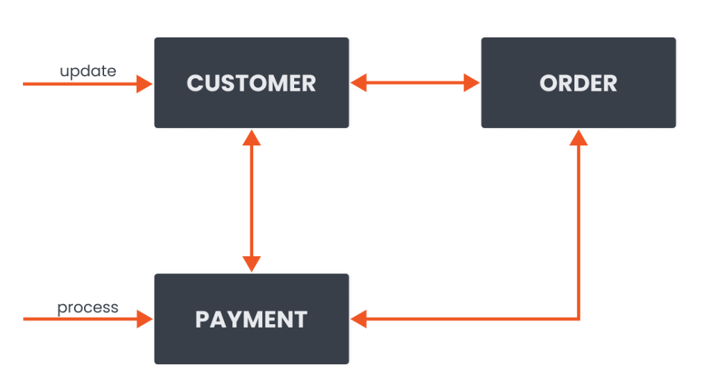
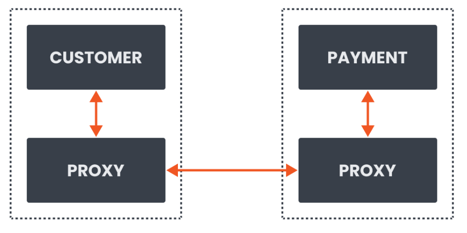
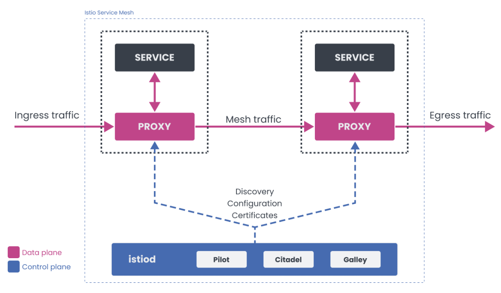

Istio(一)：服务网格和 Istio 概述

<!--more-->

## 1.模块概览

  通过本模块你将了解什么是服务网格以及它是如何工作的。我们会向你介绍为什么需要服务网格，并介绍 Istio 及其组件。在本模块结束时，你将理解服务网格的重要性，为什么你会需要服务网格，并对 Istio 服务网格有更高层面的认识。

## 微服务架构

开发人员经常将云原生应用程序分解为多个执行特定动作的服务。你可能有一个只处理客户的服务和另一个处理订单或付款的服务。所有这些服务都通过网络相互沟通。如果一个新的付款需要被处理，请求会被发送到付款服务。如果客户数据需要更新，请求会被发送到客户服务，等等。

微服务架构如下：

  

  这种类型的架构被称为微服务架构。这种架构有几个好处。你可以有多个较小的团队从事个别服务。这些团队可以灵活地选择他们的技术栈和语言，并且通常有独立部署和发布服务的自主权。这种机制得以运作得益于其背后通信网络。随着服务数量的增加，它们之间的网络通信也在增加。服务和团队的数量使得监控和管理通信逻辑变得相当复杂。由于我们也知道网络是不可靠的，它们会失败，所有这些的结合使得微服务的管理和监控相当复杂。

  ## 服务网格概述

  服务网格被定义为一个专门的基础设施层，用于管理服务与服务之间的通信，使其可管理、可见、可控制。在某些版本的定义中，你可能还会听到服务网格如何使服务间的通信安全和可靠。如果我必须用一个更直接的句子来描述服务网格，我会说，服务网格是关于服务之间的通信。

  但是，服务网格是如何帮助通信的呢？让我们思考一下通信逻辑和它通常所在的地方。在大多数情况下，开发人员将这种通信逻辑作为服务的一部分来构建。通信逻辑是处理入站或出站请求的任何代码，重试逻辑，超时，甚至可能是流量路由。因此，无论何时服务 A 调用服务 B，请求都要经过这个通信代码逻辑，这个逻辑决定如何处理这个请求。

  通信逻辑如下：

   

   我们提到，如果我们采用微服务的方法，最终可能会有大量的服务。我们如何处理所有这些服务的通信逻辑呢？我们可以创建一个包含这种逻辑的共享库，并在多个地方重用它。假设我们对所有的服务都使用相同的堆栈或编程语言，共享库的方法可能会很有效。如果我们不这样做，我们将不得不重新实现这个库，这会带来巨大的工作量而且效率低下。你也可能使用自己本身不拥有代码库的服务。在这种情况下，我们无法控制通信逻辑或监控。

    第二个问题是配置。除了配置你的应用程序外，我们还必须维护通信逻辑配置。如果我们需要同时调整或更新多个服务，我们将不得不为每个服务单独进行调整。

  服务网格所做的是，它将这种通信逻辑、重试、超时等从单个服务中分离出来，并将其移到一个单独的基础设施层。在服务网格的情况下，基础设施层是一个网络代理的阵列。这些网络代理的集合（每个服务实例旁边都有一个）处理你的服务之间的所有通信逻辑。我们称这些代理为 sidecar，因为它们与每个服务并存。

    关于sidecar的创建，可以查看博客《pod(二)：创建包含多个容器的pod（sidecar）》https://www.cnblogs.com/renshengdezheli/p/16701447.html

  Sidecar 代理如下：

  

  以前，我们让 Customer 服务直接与 Payment 服务通信，现在我们有一个 Customer 服务旁边的代理与 Payment 服务旁边的代理通信。服务网格控制平面以这样一种方式配置代理，即它们透明地拦截所有入站和出站请求。这些代理的集合（基础设施层）形成了一个网络网格，称为服务网格。

  将通信逻辑从业务和应用逻辑中分离出来，可以使开发人员专注于业务逻辑，而服务网格运维人员则专注于服务网格配置。 

  ## 3.2 为什么需要服务网格？

  服务网格为我们提供了一种一致的方式来连接、保护和观察微服务。网格内的代理捕获了网格内所有通信的请求和指标。每一次失败、每一次成功的调用、重试或超时都可以被捕获、可视化，并发出警报。此外，可以根据请求属性做出决定。例如，我们可以检查入站（或出站）请求并编写规则，将所有具有特定头值的请求路由到不同的服务版本。

 所有这些信息和收集到的指标使得一些场景可以合理地直接实现。开发人员和运营商可以配置和执行以下方案，而不需要对服务进行任何代码修改。

 mTLS 和自动证书轮换
 使用指标识别性能和可靠性问题
 在 Grafana 等工具中实现指标的可视化；这进一步允许改变并与 PagerDuty 整合，例如
 使用 Jaeger 或 Zipkin* 对服务进行调试和追踪
 基于权重和请求的流量路由，金丝雀部署，A/B 测试
 流量镜像
 通过超时和重试提高服务的弹性
 通过在服务之间注入故障和延迟来进行混沌测试
 检测和弹出不健康的服务实例的断路器。
 需要对代码进行小的修改，以便在服务之间传播跟踪头信息。

 ## 四.istio简介

 4.1 Istio 简介
Istio 是一个服务网格的开源实现。从宏观上来看 Istio 支持以下功能。

4.2 流量管理
利用配置，我们可以控制服务间的流量。设置断路器、超时或重试都可以通过简单的配置改变来完成。

4.3 可观察性
Istio 通过跟踪、监控和记录让我们更好地了解服务，让我们能够快速发现和修复问题。

4.4 安全性
Istio 可以在代理层面上管理认证、授权和通信的加密。我们可以通过快速的配置变更在各个服务中执行策略。

4.5 Istio 组件
Istio 服务网格有两个部分：数据平面和控制平面。

在构建分布式系统时，将组件分离成控制平面和数据平面是一种常见的模式。数据平面的组件在请求路径上，而控制平面的组件则帮助数据平面完成其工作。

Istio 中的数据平面由 Envoy 代理组成，控制服务之间的通信。网格的控制平面部分负责管理和配置代理。

Istio 架构如下：

 

 Envoy（数据平面）
Envoy 是一个用 C++ 开发的高性能代理。Istio 服务网格将 Envoy 代理作为一个 sidecar 容器注入到你的应用容器旁边。然后该代理拦截该服务的所有入站和出站流量。注入的代理一起构成了服务网格的数据平面。

Envoy 代理也是唯一与流量进行交互的组件。除了前面提到的功能 —— 负载均衡、断路器、故障注入等。Envoy 还支持基于 WebAssembly（WASM）的可插拔扩展模型。这种可扩展性使我们能够执行自定义策略，并为网格中的流量生成遥测数据。

Istiod（控制平面）
Istiod 是控制平面组件，提供服务发现、配置和证书管理功能。Istiod 采用 YAML 编写的高级规则，并将其转换为 Envoy 的可操作配置。然后，它把这个配置传播给网格中的所有 sidecar。

Istiod 内部的 Pilot 组件抽象出特定平台的服务发现机制（Kubernetes、Consul 或 VM），并将其转换为 sidecar 可以使用的标准格式。

使用内置的身份和凭证管理，我们可以实现强大的服务间和终端用户认证。通过授权功能，我们可以控制谁可以访问服务。

控制平面的部分以前被称为 Citadel，作为一个证书授权机构，生成证书，允许数据平面中的代理之间进行安全的 mTLS 通信。