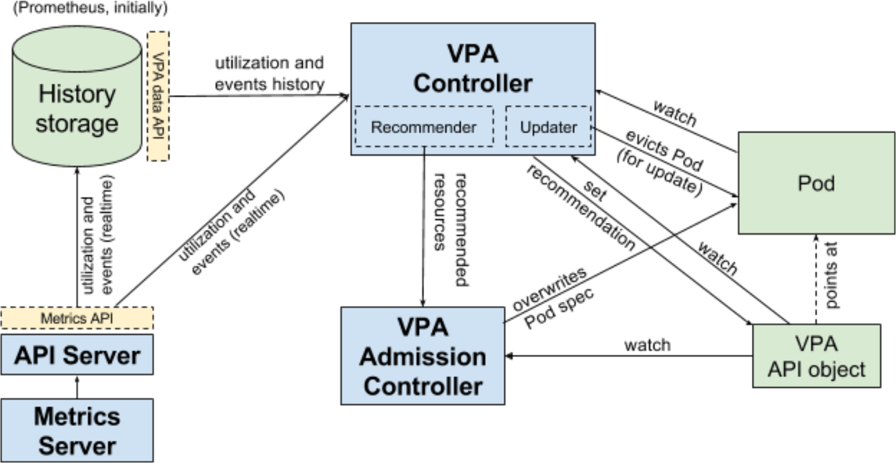
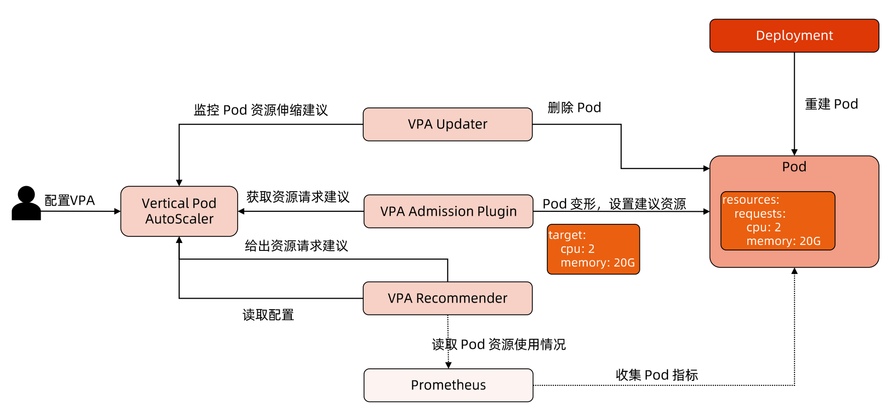

本文主要记录 k8s 中与 HPA 相对应的 VPA 功能，包括架构、大致实现以及 demo。

<!--more-->

## 什么是 VPA？

**VPA 全称 Vertical Pod Autoscaler,即垂直 Pod 自动扩缩容**,它根据容器资源使用率自动设置 CPU 和内存的requests, 以便为每个 Pod 提供适当的资源。

> 既可以缩小过度请求资源的容器，也可以根据其使用情况随时提升资源不足的容量。

使用 VPA 的意义:

* Pod 资源用其所需，提升集群节点使用效率;
* 不必运行基准测试任务来确定 CPU 和内存请求的合适值;
* VPA可以随时调整CPU和内存请求,无需人为操作，因此可以减少维护时间。


**注意**：VPA目前还没有生产就绪，在使用之前需要了解资源调节对应用的影响。


## VPA架构图




VPA 主要包括两个组件：

* 1）VPA Controller
  * Recommendr：给出 pod 资源调整建议
  * Updater：对比建议值和当前值，不一致时驱逐 Pod
* 2）VPA Admission Controller
  * Pod 重建时将 Pod 的资源请求量修改为推荐值


### VPA 工作流程

VPA 工作流程如下图所示：



**首先 **Recommender 会**根据应用当前的资源使用情况以及历史的资源使用情况，计算接下来可能的资源使用阈值**，如果计算出的值和当前值不一致则会给出一条资源调整建议。

**然后** Updater 则根据这些建议进行调整，具体调整方法为：

* 1）Updater 根据建议发现需要调整，然后调用 api 驱逐 Pod
* 2）Pod 被驱逐后就会重建，然后再重建过程中VPA Admission Controller 会进行拦截，根据 Recommend 来调整 Pod 的资源请求量
* 3）最终 Pod 重建出来就是按照推荐资源请求量重建的了。

> 根据上述流程可知，调整资源请求量需要重建 Pod，这是一个破坏性的操作，所以 VPA 还没有生产就绪。


### Recommenderd 设计理念

**推荐模型(MVP) 假设内存和CPU利用率是独立的随机变量，其分布等于过去 N 天观察到的变量(推荐值为 N=8 以捕获每周峰值)。**

* 对于 **CPU**，目标是将容器使用率超过请求的高百分比(例如95%)时的时间部分保持在某个阈值(例如1%的时间)以下。
  * 在此模型中，**CPU 使用率** 被定义为在短时间间隔内测量的平均使用率。测量间隔越短，针对尖峰、延迟敏感的工作负载的建议质量就越高。
  * **最小合理分辨率为1/min,推荐为1/sec**。

* 对于**内存**，目标是将特定时间窗口内容器使用率超过请求的概率保持在某个阈值以下(例如，**24小时内低于1%**)。
  * 窗口必须很长(≥24小时)以确保由 OOM 引起的驱逐不会明显影响(a)服务应用程序的可用性(b)批处理计算的进度(更高级的模型可以允许用户指定SLO来控制它)。


## VPA的不足

* **VPA的成熟度还不足**
* 更新正在运行的 Pod 资源配置是 VPA 的一项试验性功能，会导致 Pod 的重建和重启，而且有可能被调度到其他的节点上。
* **VPA 不会驱逐没有在副本控制器管理下的 Pod**。
* 目前 VPA 不能和监控 CPU 和内存度量的Horizontal Pod Autoscaler (HPA) 同时运行,除非 HPA 只监控其他定制化的或者外部的资源度量。
* VPA 使用 admission webhook 作为其准入控制器。如果集群中有其他的 admission webhook,需要确保它们不会与 VPA 发生冲突。准入控制器的执行顺序定义在 APIServer 的配置参数中。
* VPA 会处理出现的绝大多数 OOM 的事件，但不保证所有的场景下都有效。
* VPA 性能尚未在大型集群中进行测试。
* VPA 对 Pod 资源 requests 的修改值可能超过实际的资源上限，例如节点资源上限、空闲资源或资源配额，从而造成 Pod 处于 Pending 状态无法被调度。
  * 同时使用集群自动伸缩(ClusterAutoscaler) 可以一定程度上解决这个问题。

* 多个 VPA 同时匹配同一个 Pod 会造成未定义的行为。


### In-Place Update of Pod Resources

当前 VPA 需要重建 Pod 才能调整 resource.requst，因此局限性会比较大，毕竟频繁重建 Pod 可能会对业务稳定性有影响。

社区在 2019 年就有人提出**In-Place Update of Pod Resources** 功能，最新进展见 [#1287](https://github.com/kubernetes/enhancements/issues/1287),根据 issue 中的描述，最快在 k8s v1.26 版本就能完成 Alpha 版本。

该功能实现后对 VPA 来说是一个巨大的优化，毕竟一直破坏性的重建 Pod 风险还是有的。


##  VPA Demo

首先肯定是要有一个 k8s 集群，可以参考[Kubernetes教程(十一)---使用 KubeClipper 通过一条命令快速创建 k8s 集群](https://www.lixueduan.com/posts/kubernetes/11-install-by-kubeclipper/) 快速创建一个。

> 为了和本文保持一致，建议使用 centos7.9 + k8s v1.23.6


### openssl

VPA 需要 openssl 1.1.1 及以上版本，安装前先检查一下。

```bash
$ openssl version
OpenSSL 1.0.2k-fips  26 Jan 2017
```

 openssl 1.1.1 一键安装脚本如下：

```bash
#!/bin/bash
set -e

# centos一键安装openssl 1.1.1 版本
# 下载相关依赖
yum update -y
yum install -y wget tar make gcc perl pcre-devel zlib-devel
# 下载 openssl 1.1.1 版本源码
wget https://www.openssl.org/source/openssl-1.1.1g.tar.gz
tar zxvf openssl-1.1.1g.tar.gz
cd openssl-1.1.1g
# 开始编译
./config --prefix=/usr --openssldir=/etc/ssl --libdir=lib no-shared zlib-dynamic
make && make install

# 查看是否安装成功
openssl version
echo 'openssl install finish.'
```


### Metrics Server

VPA 依赖于 Metrics Server 提供的指标信息，因此需要使用以下命令在集群中安装 Metrics Server：

```bash
# 从官方仓库获取yaml文件
curl https://github.com/kubernetes-sigs/metrics-server/releases/download/v0.6.1/components.yaml -o metrics-server.yaml
# 替换镜像
sed -i 's/k8s.gcr.io\/metrics-server\/metrics-server:v0.6.1/dyrnq\/metrics-server:v0.6.1/' metrics-server.yaml
```

添加`--kubelet-insecure-tls` flag 以跳过 tls，具体修改如下：

```yaml
apiVersion: apps/v1
kind: Deployment
metadata:
  labels:
    k8s-app: metrics-server
  name: metrics-server
  namespace: kube-system
spec:
  selector:
    matchLabels:
      k8s-app: metrics-server
  strategy:
    rollingUpdate:
      maxUnavailable: 0
  template:
    metadata:
      labels:
        k8s-app: metrics-server
    spec:
      containers:
      - args:
        - --cert-dir=/tmp
        - --secure-port=4443
        - --kubelet-insecure-tls # 增加该 flag
        - --kubelet-preferred-address-types=InternalIP,ExternalIP,Hostname
        - --kubelet-use-node-status-port
        - --metric-resolution=15s
        image: dyrnq/metrics-server:v0.6.1 # 替换为国内能访问的镜像
```


确认当前集群可以使用 kubectl  top 功能

```bash
kubectl top node
```


### 启动 vpa

VPA 与 k8s 版本兼容性如下：

| VPA version | Kubernetes version |
| ----------- | ------------------ |
| 0.12        | 1.25+              |
| 0.11        | 1.22 - 1.24        |
| 0.10        | 1.22+              |
| 0.9         | 1.16+              |

当前使用的是 k8s 1.23.6 版本，根据 VPA 兼容性，这个版本的 k8s 需要使用 VPA 0.11 版本。

先拉一下代码

```bash
git clone -b vpa-release-0.11 https://github.com/kubernetes/autoscaler.git
```

然后把里面用到的 gcr 镜像都替换以下，全部换成 dockerhub 的

```bash
sed -i 's/k8s.gcr.io\/autoscaling/k8sgcrioautoscaling/' deploy/admission-controller-deployment.yaml
sed -i 's/k8s.gcr.io\/autoscaling/k8sgcrioautoscaling/' deploy/recommender-deployment.yaml
sed -i 's/k8s.gcr.io\/autoscaling/k8sgcrioautoscaling/' deploy/updater-deployment.yaml
```

然后使用仓库里的脚本启动 VPA

```bash
cd vertical-pod-autoscaler
./hack/vpa-up.sh
```


VPA 一共包含 3 个组件：

* 1）recommender
* 2）updater
* 3）admission-controller

检测是否全部启动

```bash
$ kubectl -n kube-system get po
vpa-admission-controller-778b7f4fff-8f6ql   1/1     Running   0          7m45s
vpa-recommender-5479996844-2f6gg            1/1     Running   0          7m46s
vpa-updater-745454495c-lv8bg                1/1     Running   0          7m47s
```


### 测试

首先创建一个 deployment,pod 里跑了一个死循环，主要用于占用 cpu

```yaml
cat > deploy.yaml << EOF
apiVersion: apps/v1
kind: Deployment
metadata:
  name: hamster
spec:
  selector:
    matchLabels:
      app: hamster
  replicas: 2
  template:
    metadata:
      labels:
        app: hamster
    spec:
      securityContext:
        runAsNonRoot: true
        runAsUser: 65534 # nobody
      containers:
        - name: hamster
          image: gcmirrors/ubuntu-slim:0.1
          resources:
            requests:
              cpu: 100m
              memory: 50Mi
          command: ["/bin/sh"]
          args:
            - "-c"
            - "while true; do timeout 0.5s yes >/dev/null; sleep 0.5s; done"
EOF
```

```bash
kubectl apply -f deploy.yaml
```


启动后查看 pod 的 cpu 占用情况

```bash
[root@vpa vertical-pod-autoscaler]# kubectl top pod
NAME                       CPU(cores)   MEMORY(bytes)   
hamster-6f6567cc69-jwbts   503m         1Mi             
hamster-6f6567cc69-qnhph   504m         1Mi 
```

可以看到很快就已经超过设置的阈值了。


然后创建一个 vpa对象，测试是否会自动更新资源请求量：

```yaml
cat > vpa.yaml << EOF
apiVersion: "autoscaling.k8s.io/v1"
kind: VerticalPodAutoscaler
metadata:
  name: hamster-vpa
spec:
  # recommenders field can be unset when using the default recommender.
  # When using an alternative recommender, the alternative recommender's name
  # can be specified as the following in a list.
  # recommenders:
  #   - name: 'alternative'
  targetRef:
    apiVersion: "apps/v1"
    kind: Deployment
    name: hamster
  resourcePolicy:
    containerPolicies:
      - containerName: '*'
        minAllowed:
          cpu: 100m
          memory: 50Mi
        maxAllowed:
          cpu: 1
          memory: 500Mi
        controlledResources: ["cpu", "memory"]
EOF
```

```bash
kubectl apply -f vap.yaml
```


创建 vpa 对象后耐心等待一会，vpa 就会给出推荐建议

```bash
$ kubectl describe vpa

Status:
  Conditions:
    Last Transition Time:  2022-10-15T06:30:43Z
    Status:                True
    Type:                  RecommendationProvided
  Recommendation:
    # 可以看到当前已经给出了调整建议
    Container Recommendations:
      Container Name:  hamster
      Lower Bound:
        Cpu:     211m
        Memory:  262144k
      Target:
        Cpu:     627m
        Memory:  262144k
      Uncapped Target:
        Cpu:     627m
        Memory:  262144k
      Upper Bound:
        Cpu:     1
        Memory:  500Mi
Events:          <none>

```

然后之前创建的 pod 就会使用新的 resource.request 值重建，当前 pod 情况如下：

```bash
[root@vpa vertical-pod-autoscaler]# kubectl get po
NAMESPACE     NAME                                        READY   STATUS    RESTARTS   AGE
default       hamster-6f6567cc69-qnhph                    1/1     Running   0          4m38s
default       hamster-6f6567cc69-t8rc9                    1/1     Running   0          47s
```

根据上面的时间可以看出来第二个 pod 已经被重建过了，查看一下当前的 resource.request

```bash
kubectl get po hamster-6f6567cc69-t8rc9 -oyaml

spec:
  containers:
  - args:
    - -c
    - while true; do timeout 0.5s yes >/dev/null; sleep 0.5s; done
    command:
    - /bin/sh
    image: gcmirrors/ubuntu-slim:0.1
    imagePullPolicy: IfNotPresent
    name: hamster
    resources:
      requests:
        cpu: 627m
        memory: 262144k
```

可以看到当前的 resources.request 就是前面给出的建议值，说明 VPA 功能正常。

至此 VPA demo 结束。


## 小结

本文主要分析了 VPA 的架构、工作流程以及 VPA 的不足，最后使用 demo 进行了演示。

当前 VPA 限制还比较多，特别是 In-Place Update of Pod Resources 功能缺失的情况下，需要重建 Pod 才能实现资源请求量的调整，影响比较大。

总之当前版本的 VPA 还不是很推荐使用。

## 参考

[vpa-design-proposal](https://github.com/kubernetes/design-proposals-archive/blob/acc25e14ca83dfda4f66d8cb1f1b491f26e78ffe/autoscaling/vertical-pod-autoscaler.md)

[In-Place Update of Pod Resources](https://github.com/kubernetes/enhancements/issues/1287)