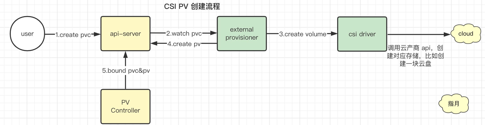
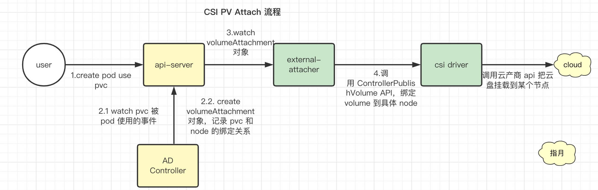

本文主要对 PV 从创建到挂载全流程进行了简单分析，包括存储卷的动态供应(Dynamically Provision)以及最终被挂载到 Pod 中被我们的app 所使用。

<!--more-->

## 1. 概述

本文主要分析以下两个步骤：

* 1）PV 的创建：即在 k8s 中创建一个 pv 对象
* 2）PV 的挂载：即创建 Pod 指定使用该 PVC，Pod 启动后 PV 被挂载到 Pod 中

其中创建部分又可以分为两种：

* 静态供应：即管理员手动创建 PV
* 动态供应：由 k8s 根据 PVC 自动创建对应 PV

主流的方式为 **动态供应**，毕竟管理员无法预估集群使用者需要什么样的 PV，也就不可能提前创建好一模一样的 PV，开发人员又可能不了解存储，无法自己创建，最终只能等 Pod 启动时在通知管理员创建 PV ，这样就太麻烦了。


**环境准备**

这里需要一个部署好了存储插件的 k8s 集群。

* 推荐使用 kubeclipper 安装集群，具体可以参考 [Kubernetes教程(十一)---使用 KubeClipper 通过一条命令快速创建 k8s 集群](https://www.lixueduan.com/posts/kubernetes/11-install-by-kubeclipper/)
* 同时这里有一个 [安装 NFS 的脚本](https://github.com/barrypt/i-go/blob/77d058c885b9086cdc6a35a35b564f5e8f34d2b2/shell/install-nfs.sh)，等会可以作为存储后端使用


## 2. PV 的创建




### 1. 创建 PVC

首先创建一个 pvc。

> 这里需要注意 storageClassName，如果是用 kubeclipper 安装的，那么默认的名字就是 nfs-sc。

```bash
cat > pvc.yaml << EOF
apiVersion: v1
kind: PersistentVolumeClaim
metadata:
  name: csi-test-pvc
spec:
  accessModes:
    - ReadWriteOnce
  resources:
    requests:
      storage: 1Gi
  storageClassName: nfs-sc
EOF
```

```bash
kubectl apply -f pvc.yaml
```


### 2. PVController 绑定 PV & PVC

PVC 创建之后就轮到 **PersistentVolumeController** 登场了。

> PVController 即 PersistentVolumeController，是 kube-controller-manager 的一部分

PersistentVolumeController 会不断地查看当前每一个 PVC，是不是已经处于 Bound（已绑定）状态。如果不是，那它就会遍历所有的、可用的 PV，并尝试将其与这个“单身”的 PVC 进行绑定。

> 相关源码  [pkg/controller/volume/persistentvolume/pv_controller_base.go](https://github.com/kubernetes/kubernetes/blob/e62cfabf9326cdec65e926b697fa1911b4e85da6/pkg/controller/volume/persistentvolume/pv_controller_base.go#L306-L334)

由于这时候还没有对应的 pv，因此会一直绑定不了，直到有 pv 创建出来。


### 3. Dynamically Provision & external-provisioner

创建 pvc 之后同时也会进入 dynamically provision 流程。

> 如果有部署 CSI 的话。

部署的 CSI Plugin 里有一个叫做 external-provisioner 的pod，这时候 **[external-provisioner](https://github.com/kubernetes-csi/external-provisioner)** 就起作用了，他会 watch pvc 对象，因为这里我们创建了 PVC，那么 provisioner 就会收到相应事件，然后根据 PVC 中的 storageClassName 拿到对应 StorageClass，然后根据 StorageClass 中的 provisioner 字段拿到对应 provisioner，如果发现是自己处理的，就调用 **CSI** **Plugin** 的 CreateVolume 方法创建出 volume。

> CSI Plugin CreateVolume 接口则由具体厂商实现，比如 阿里云实现的 CreateVolume 可能就是在阿里云上创建了一块云盘。

创建成功后就在 k8s 里创建对应的 PV 来指代这个 volume。最后 PV 创建之后，PVController 就 可以将二者进行绑定。

> 这里的 bind 只是修改了 pvc 和 pv 对象的字段


查看创建的 pvc 和 pv

```Bash
[root@ee ~]# kubectl get pvc
NAME           STATUS   VOLUME                                     CAPACITY   ACCESS MODES   STORAGECLASS   AGE
csi-test-pvc   Bound    pvc-047acd58-808e-4f26-83c6-df59e8e00e65   1Gi        RWO            nfs-sc         3m49s
[root@ee ~]# kubectl get pv
NAME                                       CAPACITY   ACCESS MODES   RECLAIM POLICY   STATUS   CLAIM                  STORAGECLASS   REASON   AGE
pvc-047acd58-808e-4f26-83c6-df59e8e00e65   1Gi        RWO            Delete           Bound    default/csi-test-pvc   nfs-sc                  3m59s
```

> 可以看到 pvc 中的 VolumeName 就是 pv 的名字，同时已经进入 Bound 状态，说明在 PV 被创建出来之后 PVController 立马就将二者进行绑定了。


## 3. 创建 Pod 使用该 PVC

然后创建一个 pod 使用该 pvc

```Bash
cat > pod.yaml << EOF
apiVersion: v1
kind: Pod
metadata:
  name: test-pod1
spec:
  volumes:
    - name: task-pv-storage
      persistentVolumeClaim:
        claimName: csi-test-pvc
  containers:
    - name: task-pv-container
      image: nginx
      ports:
        - containerPort: 80
          name: "http-server"
      volumeMounts:
        - mountPath: "/usr/share/nginx/html"
          name: task-pv-storage
EOF
```

```bash
kubectl apply -f pod.yaml
```

> 这里随便创建了一个 Pod，用于测试。

根据 pod.yaml 可知，是通过 claimName 来指定要使用的 PVC 的，然后前面 PVC 和 PV 绑定的时候会把 PV 的名字填到 PVC 的 spec.volumeName 字段上，因此这里又可以找到对应的 PV，然后就进入 **Volume 挂载流程**了。


Pod 创建后 k8s-scheduler 会把 pod 调度到某个 node 上。

> 从 etcd 角度看就是更新了 pod 的 spec.nodeName 字段。

Pod 被调度到某节点后，并不会立刻被创建出来，因为对应的 PV 还需要经过 attach、mount 两个阶段才能被 pod 使用，因此在创建 Pod 前还需要对 PV 进行处理。

> 像 nfs 这种文件系统则不需要 attach 阶段，不过这里为了流程完整性，还是分析一下。


### 1. Attach

attach 由 ad controller 以及 external-attacher 两个组件共同完成，如下图所示：



#### AD Controller

> ADController 即 AttachDetach Controller，负责 PV 的 attach/detach 处理。

**大致逻辑**：AD Controller 会获取当前 Node 上的 Pod，然后 Pod 的 Volume 列表计算出 该 Node 上的 PV 列表，然后和 node.Status.VolumesAttached 值进行对比，没有 attach 的话就执行 attach 操作。

> Attach 之前还会做一个 MultiAttach check，如果是 RWO 类型的 Volume，然后还已经在别的节点 attach 了，那么这里直接报错。具体流程见后续的源码分析部分。

**为了进行解耦**，AD Controller 并不会直接调用 CSI Plugin 去执行 attach，而是创建一个叫做 VolumeAttachment 的对象，大概是长这样的：

```YAML
apiVersion: storage.k8s.io/v1
kind: VolumeAttachment
metadata:
  creationTimestamp: "2022-11-10T02:55:16Z"
  name: csi-ac6258582f9363a9af542dbde1161db00bddf492ea1522e6a92c2f35c3d815c5
  resourceVersion: "142813"
  uid: 713ee91b-d256-45c9-a9ba-5d11ad3b7e5c
spec:
  attacher: nfs.csi.k8s.io
  nodeName: ee
  source:
    persistentVolumeName: pvc-047acd58-808e-4f26-83c6-df59e8e00e65
status:
  attached:  false
```

里面记录了 3 个重要信息，attacher、nodeName 和 persistentVolumeName，后续会用到,然后 status.attached 则是用于记录是否真的 attach 了。

等 external-attacher 处理完成后，ADController  就会更新 node.Status.VolumesAttached，把这个 Volume 记录上去。

更新后的 node 信息如下：

> 已省略其他信息

```Bash
[root@ee ~]# kubectl get node  ee -oyaml
apiVersion: v1
kind: Node
metadata:
  name: ee
spec:
  podCIDR: 10.96.0.0/24
  podCIDRs:
  - 10.96.0.0/24
status:
  volumesAttached:
  - devicePath: ""
    name: kubernetes.io/csi/nfs.csi.k8s.io^172.20.151.105#tmp/nfs/data/lxd-host#pvc-047acd58-808e-4f26-83c6-df59e8e00e65#
  volumesInUse:
  - kubernetes.io/csi/nfs.csi.k8s.io^172.20.151.105#tmp/nfs/data/lxd-host#pvc-047acd58-808e-4f26-83c6-df59e8e00e65#
```


**kubelet 启动参数--enable-controller-attach-detach**

AD Cotroller 与 kubelet 中的 volume manager 逻辑相似，都可以做 Attach/Detach 操作，但是 kube-controller-manager 与 kubelet 中只会有一个组件做 Attach/Detach 操作，具体则是通过 kubelet 启动参数 **--enable-controller-attach-detach** 来设置。

设置为 true 表示启用 kube-controller-manager 的 AD controller 来做 Attach/Detach 操作，同时禁用 kubelet 执行 Attach/Detach 操作。

> 默认值为 true，即让 kube-controller-manager 的 AD controller来做 Attach/Detach 操作。

注意：这个是 kubelet 的配置，而每个节点都会运行一个 kubelet，也就是说不同的节点可以有不同的配置，比如 node1 用AD controller来做 Attach/Detach ，node2 则让 kubelet 来做。

> Q：不知道这个配置有什么作用，难道是历史遗留问题？？
>
> A：从这个 Issue [#10](https://github.com/AliyunContainerService/flexvolume/issues/10#issuecomment-484853588flexvolume) 来看，好像是和 flexvolume 有关， flexvolume 的 Attach/Detach 只能在对应节点做，因此需要配置该参数为 false ，让 kubelet 来完成 Attach/Detach 操作。不过现在都是 CSI 了应该不用管了。


#### external-attacher

VolumeAttachment 创建后就交给 [external-attacher](https://github.com/kubernetes-csi/external-attacher) 了，external-attacher 会 watch VolumeAttachment 对象。根据 .spec.attacher 判断是不是需要自己处理，如果是则

调用 CSI Plugin 的 ControllerPublishVolume 方法，将 .spec.persistentVolumeName 这个 Volume attach 到 .spec.nodeName 这个节点上。

> 具体实现就看 CSI Plugin 了，可能是简单的调用了一个 云厂商的 API。

Attach 成功后(即调用 ControllerPublishVolume 方法没有报错) external-attacher 就会把 .status.attached 改为 true。

至此 attach 阶段就完成了，进入后续的 mount 阶段。

### 2. Mount

mount 阶段则由 kubelet 中的 volume manager 来完成。

#### kubelet & volume manager

Mount 阶段则由对应节点的 kubelet 中的 volume manager 处理。

volume manager 获取 node.Status.VolumesAttached 属性值，发现 volume 已被标记为 attached；

就会进行 mount 操作，调用 CSI 的 NodeStageVolume 和 NodePublishVolume 接口。

kubelet 会调用 VolumeManager，为 pods 准备存储设备，存储设备就绪会挂载存储设备到 pod 所在的节点上，并在容器启动的时候挂载在容器指定的目录中；同时，删除卸载不在使用的存储。

相关代码如下：

```Go
func (rc *reconciler) reconcile() {
   // Unmounts are triggered before mounts so that a volume that was
   // referenced by a pod that was deleted and is now referenced by another
   // pod is unmounted from the first pod before being mounted to the new
   // pod.
   rc.unmountVolumes()

   // Next we mount required volumes. This function could also trigger
   // attach if kubelet is responsible for attaching volumes.
   // If underlying PVC was resized while in-use then this function also handles volume
   // resizing.
   rc.mountOrAttachVolumes()

   // Ensure devices that should be detached/unmounted are detached/unmounted.
   rc.unmountDetachDevices()
}
```

整个 reconcile 包括 3 个方法

- unmountVolumes：遍历 node 上的 mountedVolume，检查 pod 还在不在，如果 pod 不在了就把对应 volume unmount 了。

- mountOrAttachVolumes：遍历需要 mount 或者 attach 的 volume，看下是不是真的  mount 或者 attach了，没有就执行  mount 或者 attach。

- unmountDetachDevices：如果某个设备的多个 volume 都是 unmount 状态那就把该设备 detach 掉。

在 mountOrAttachVolumes 方法中，由于设备需要先 attach，因此 kubelet 这里会一直阻塞，产生一个叫做 VolumeNotAttached 的错误，这个就要靠前面的 ADController 了，ADController 把 Volume Attach 之后，kubelet 这边就开始 mount。

> 如果这里 CSI Driver 中的 requiredAttach 配置为 false 则这里会默认 Volume 已经 attach 了，然后开始 mount。
>
> 具体源码 [pkg/volume/util/operationexecutor/operation_generator.go#L1508-L1522](https://github.com/kubernetes/kubernetes/blob/b3d53a512ffe86ff80243a5debedd44563a040c8/pkg/volume/util/operationexecutor/operation_generator.go#L1508-L1522)

Kubelet 会根据具体的 PV 名字找到对应的 CSI Driver，然后 调用 CSI 的 NodeStageVolume 和 NodePublishVolume 接口完成 mount。

> 具体源码  [pkg/volume/util/operationexecutor/operation_generator.go#L530-L748](https://github.com/kubernetes/kubernetes/blob/b3d53a512ffe86ff80243a5debedd44563a040c8/pkg/volume/util/operationexecutor/operation_generator.go#L530-L748)
>
> NodeStageVolume 被封装到了 MountDevice 方法里，而 NodePublishVolume 则是封装到了  MapPodDevice 里。


至此，存储相关的基本流程就结束了，至于删除则是按照相反的流程执行。


还有下面这两个 Sidecar 没有讲解，不过看名字应该也能知道大概是做什么的：

- [external-snapshotter](https://github.com/kubernetes-csi/external-snapshotter) ：存储卷快照

- [external-resizer](https://github.com/kubernetes-csi/external-resizer)：存储卷扩容


## 4. 小结

k8s中涉及存储的组件主要有：attach/detach controller、pv controller、volume manager、volume plugins、scheduler。每个组件分工明确：

- **attach/detach controller**：负责对 volume 进行 attach/detach

- **persistent volume controller**：负责处理 pv/pvc 对象，包括 pv 的 provision/delete

- **kubelet volume manage**r：主要负责对 volume 进行 mount/unmount

- **volume plugins**：包含 k8s 原生的和各厂商的的存储插件

具体流程：

一共可以分为 3 个步骤：

1）**Create**

* 用户创建 PV 后 external-provisioner pod watch 到 pvc 创建事件 ，并根据具体信息调用 CSI Plugin 的 CreateVolume 方法创建对应 PV，以实现动态供应。
* PV 创建后由 PVController 将 PV 和 PVC 进行绑定

2）**Attach**

* 创建 Pod，Pod 的 spec.Volume 中指定要使用的 PVC 的名字，pod 创建后由 Scheduler 调度到指定节点。
* 然后 ADController 则会根据当前 Node 上已经 Attach 的 Volume 以及当前 Node 上的 Pod 列表中提取出的 Volume 列表进行调谐，把Pod 用到的但是当前没有 Attach 的 Volume 进行 Attach。实际为创建一个 VolumeAttachment 对象。
* 由 external-attacher 来 watch 这个 VolumeAttachment 对象，并根据里面的信息来调用 CSI Plugin 的 ControllerPublishVolume 方法进行 Attch。

3）**Mount**

* Volume Attach 完成后则由 Kubelet 中的 Volume Manager 来执行 Mount 操作，最终则是调用 CSI Plugin 的 NodeStageVolume 和 NodePublishVolume 方法

以上就是 Pod 使用 PV 的基本流程。
