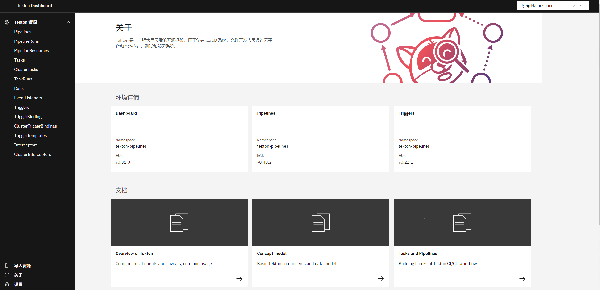

本文主要记录了如何在 k8s 上快速部署云原生的  CI/CD 框架 tekton 的各个组件，包括 pipeline、trigger、dashboard 等，最后运行了一个简单的 demo 以体验 tekton 的功能。

<!--more-->

## 1. Tekton 是什么？

[Tekton](https://tekton.dev/) 是一款功能非常强大而灵活的开源的 CI/CD 云原生框架。Tekton 的前身是 Knative 项目的 build-pipeline 项目，这个项目是为了给 build 模块增加 pipeline 的功能，但是随着不同的功能加入到 Knative build 模块中，build 模块越来越变得像一个通用的 CI/CD 系统，于是，索性将 build-pipeline 剥离出 Knative，就变成了现在的 Tekton，而 Tekton 也从此致力于提供全功能、标准化的云原生 CI/CD 解决方案。

即：**Tekton 是云原生的  CI/CD 框架，是云原生的的 CI/CD 解决方案**。


### 优点

Tekton 为 CI/CD 系统提供了诸多好处：

- **可定制**：Tekton 是完全可定制的，具有高度的灵活性，我们可以定义非常详细的构建块目录，供开发人员在各种场景中使用。
  - 比较基础的功能，应该是所有  CI/CD 系统都有这个功能
- **可重复使用**：Tekton 是完全可移植的，任何人都可以使用给定的流水线并重用其构建块，可以使得开发人员无需"造轮子"就可以快速构建复杂的流水线。
  - 所有工作都运行在 pod 中，对外部系统无依赖，无缝迁移
- **可扩展**：`Tekton Catalog`是社区驱动的 Tekton 构建块存储库，我们可以使用 `Tekton Catalog`中定义的组件快速创建新的流水线并扩展现有管道。
  - dockerhub 之于 docker，用于存放 Tekton 自己的模块
- **标准化**：Tekton 在你的 Kubernetes 集群上作为扩展安装和运行，并使用完善的 Kubernetes 资源模型，Tekton 工作负载在 Kubernetes Pod 内执行。
  - 云原生体现之一，完全兼容 k8s 标准，对环境没有要求，只要是标准 k8s 集群就能运行
- **伸缩性**：要增加工作负载容量，只需添加新的节点到 k8s 集群即可，Tekton 可随集群扩展，无需重新定义资源分配或对管道进行任何其他修改。
  - 云原生体现之一，完全利用 k8s 的能力


> 感觉**云原生的  CI/CD 框架**指的应该是 tekton 完全兼容 k8s 资源模型，可以在任意标准 k8s 集群中部署，同时能够充分利用 k8s 的各项能力，比如伸缩性，只要 k8s 集群添加节点即可，tekton 不需要做任何工作。
>
> 即：Tekton 能够很好的和 k8s 配合。


### 组件

Tekton 由一些列组件组成：

- `Tekton Pipelines`：是 Tekton 的基础，它定义了一组 Kubernetes CRD 作为构建块，我们可以使用这些对象来组装 CI/CD 流水线。
- `Tekton Triggers`：允许我们根据事件来实例化流水线，例如，可以我们在每次将 PR 合并到 GitHub 仓库的时候触发流水线实例和构建工作。
- `Tekton CLI`：提供了一个名为 `tkn`的命令行界面，它构建在 Kubernetes CLI 之上，运行和 Tekton 进行交互。
- `Tekton Dashboard`：是 `Tekton Pipelines`的基于 Web 的一个图形界面，可以线上有关流水线执行的相关信息。
- `Tekton Catalog`：是一个由社区贡献的高质量 Tekton 构建块（任务、流水线等）存储库，可以直接在我们自己的流水线中使用这些构建块。
- `Tekton Hub`：是一个用于访问 `Tekton Catalog`的 Web 图形界面工具。
- `Tekton Operator`：是一个 Kubernetes Operator，可以让我们在 Kubernetes 集群上安装、更新、删除 Tekton 项目。


因此我们只要部署 **Tekton Pipelines** 以及 **Tekton Triggers** 就能拥有完成的 CI/CD 流程，为了便于查看可以在部署一个 **Tekton Dashboard**。


## 2. 部署

本文主要记录 tektoncd 的部署过程。整个部署实际很简单，不过 tektoncd 所有镜像默认存放在 gcr.io 的，导致国内使用比较困难，镜像问题算是部署中最大的一个难点。

因此在写这篇文章时将当前用到的所有镜像都推送到了 [dockerhub/lixd96](https://hub.docker.com/u/lixd96?page=1) 这个用户下，大家可以直接使用，同时文章里提供了脚本用于将官方 yaml 中的镜像替换为  [dockerhub/lixd96](https://hub.docker.com/u/lixd96?page=1) 下的镜像，从而解决使用官方 yaml 部署导致的无法从 gcr.io 拉取镜像的问题。

> 根据这篇文章操作，不出意外的话应该几分钟就能完成部署，整个过程非常丝滑~


本文部署的各个组件版本分别是 

- Pipeline v0.43.2 
- Trigger v0.22.1  
- Dashboard  v0.31.0


由于国内的特殊环境，整个部署过程分为以下几部分：

* 1）下载对应版本的 yaml 文件
* 2）替换 yaml 文件中的镜像
* 3）从 dockerhub 拉取镜像
  * 这一步可以忽略，只是习惯在部署前先准备好镜像
* 4）Apply 到 k8s 集群


### 环境准备

首先我们需要一个 k8s 集群，单节点即可。

如果没有 k8s 环境的话可以参数这篇文章：[Kubernetes教程(十一)---使用 KubeClipper 通过一条命令快速创建 k8s 集群](https://www.lixueduan.com/posts/kubernetes/11-install-by-kubeclipper/)，快速搭建一个。

使用 kubeclipper 工具，大概两三分钟就能创建出一个 k8s 集群，本文的演示环境也是通过该工具推出来的，非常好用~


### 部署 Pipeline

下载 0.43.2 版本的 yaml

```Bash
curl https://storage.googleapis.com/tekton-releases/pipeline/previous/v0.43.2/release.yaml -o pipeline.yaml
```

使用 sed 命令挨个替换镜像

```Bash
sed -i 's/gcr.io\/tekton-releases\/github.com\/tektoncd\/pipeline\/cmd\/controller:v0.43.2@sha256:e1a541216f70bfc519739e056111d0f69e7959913e28ccbf98ce9fe2fd0dd406/lixd96\/tektoncd-pipeline-cmd-controller:v0.43.2/' pipeline.yaml

sed -i 's/gcr.io\/tekton-releases\/github.com\/tektoncd\/pipeline\/cmd\/resolvers:v0.43.2@sha256:5ea2565c256a5085ee422d4778166fd1fe0f985ff6e3816542728379433f30db/lixd96\/tektoncd-pipeline-cmd-resolvers:v0.43.2/' pipeline.yaml


sed -i 's/gcr.io\/tekton-releases\/github.com\/tektoncd\/pipeline\/cmd\/webhook:v0.43.2@sha256:e2bc5e55370049efa5ed3e16868ecec65fb9cdb6df0fd7e08568a8b6f3193186/lixd96\/tektoncd-pipeline-cmd-webhook:v0.43.2/' pipeline.yaml

sed -i 's/gcr.io\/tekton-releases\/github.com\/tektoncd\/pipeline\/cmd\/kubeconfigwriter:v0.43.2@sha256:449fae542ca42a94171c7e6fe41af4451c62126743f77b47f09bbcecc932145e/lixd96\/tektoncd-pipeline-cmd-kubeconfigwriter:v0.43.2/' pipeline.yaml

sed -i 's/gcr.io\/tekton-releases\/github.com\/tektoncd\/pipeline\/cmd\/git-init:v0.43.2@sha256:cd5fb697a91af1883917e5e8ab230566bff60fd1310fb2d0e12badcee7db5db6/lixd96\/tektoncd-pipeline-cmd-git-init:v0.43.2/' pipeline.yaml


sed -i 's/gcr.io\/tekton-releases\/github.com\/tektoncd\/pipeline\/cmd\/entrypoint:v0.43.2@sha256:50333090b874cdff1706d9f4de9d367270586d91a3204f223ad3c9c8f8b5968b/lixd96\/tektoncd-pipeline-cmd-entrypoint:v0.43.2/' pipeline.yaml
 

sed -i 's/gcr.io\/tekton-releases\/github.com\/tektoncd\/pipeline\/cmd\/nop:v0.43.2@sha256:6c99e85668d5c5d383ee341fb22affb71ea2908f5615a3ec0157980ac1891ef4/lixd96\/tektoncd-pipeline-cmd-nop:v0.43.2/' pipeline.yaml


sed -i 's/gcr.io\/tekton-releases\/github.com\/tektoncd\/pipeline\/cmd\/sidecarlogresults:v0.43.2@sha256:8c7e3dbb3cbfa76e9d291d869d50c93b4b9001dab6e3143d5db7b4e297144814/lixd96\/tektoncd-pipeline-cmd-sidecarlogresults:v0.43.2/' pipeline.yaml


sed -i 's/gcr.io\/tekton-releases\/github.com\/tektoncd\/pipeline\/cmd\/imagedigestexporter:v0.43.2@sha256:768185690a3c5b5a79c764fe3d66bac8351136a14dd82d9fd7da019789b4ed95/lixd96\/tektoncd-pipeline-cmd-imagedigestexporter:v0.43.2/' pipeline.yaml


sed -i 's/gcr.io\/tekton-releases\/github.com\/tektoncd\/pipeline\/cmd\/pullrequest-init:v0.43.2@sha256:8f5809192c455ea3a657203337e139482b06ffdef1a32d3ad494d6bcdb7c1465/lixd96\/tektoncd-pipeline-cmd-pullrequest-init:v0.43.2/' pipeline.yaml


sed -i 's/gcr.io\/tekton-releases\/github.com\/tektoncd\/pipeline\/cmd\/workingdirinit:v0.43.2@sha256:707cf41528b19e7b20925fcfe17b1ebf8e61a22fe824df6b79c17b36f81a2d19/lixd96\/tektoncd-pipeline-cmd-workingdirinit:v0.43.2/' pipeline.yaml
```

从 dockerhub 拉取镜像

```Bash
tag=v0.43.2

images="
controller
entrypoint
git-init
imagedigestexporter
kubeconfigwriter
nop
pullrequest-init
resolvers
sidecarlogresults
webhook
workingdirinit
"

for image in $images;do ctr --namespace k8s.io image pull docker.io/lixd96/tektoncd-pipeline-cmd-$image:$tag;done
```

apply 到 k8s

```Bash
kubectl apply -f pipeline.yaml
```

会启动 3 个 pod

```Bash
[root@caas-console ~]# kubectl get po -A|grep tekton
tekton-pipelines-resolvers   tekton-pipelines-remote-resolvers-774848479b-x6759   1/1     Running   0          44s
tekton-pipelines             tekton-pipelines-controller-68fb8c9df6-r755w         1/1     Running   0          44s
tekton-pipelines             tekton-pipelines-webhook-b54b6d464-ppb7f             1/1     Running   0          44s
```


### 部署 Trigger

先下载 v0.22.1 版本对应的两个 yaml

```Bash
curl https://storage.googleapis.com/tekton-releases/triggers/previous/v0.22.1/release.yaml -o trigger-release.yaml

curl https://storage.googleapis.com/tekton-releases/triggers/previous/v0.22.1/interceptors.yaml -o trigger-interceptors.yaml
```

然后使用 sed 替换镜像

```Bash
sed -i 's/gcr.io\/tekton-releases\/github.com\/tektoncd\/triggers\/cmd\/controller:v0.22.1@sha256:47f18d03c08ebc8ef474dd62e7d83ead3c4aa802c72668dafb73fd6afedd305f/lixd96\/tektoncd-triggers-cmd-controller:v0.22.1/' trigger-release.yaml


sed -i 's/gcr.io\/tekton-releases\/github.com\/tektoncd\/triggers\/cmd\/webhook:v0.22.1@sha256:9a124b2ead10a6bc3ae1d32d05b9fe664465cfe6d09830ef89f3987a443a5c86/lixd96\/tektoncd-triggers-cmd-webhook:v0.22.1/' trigger-release.yaml

sed -i 's/gcr.io\/tekton-releases\/github.com\/tektoncd\/triggers\/cmd\/eventlistenersink:v0.22.1@sha256:bd8b2ec63012605739dc74871d1a20634d1055ed3d77864a582a9b5f2d22ab92/lixd96\/tektoncd-triggers-cmd-eventlistenersink:v0.22.1/' trigger-release.yaml


sed -i 's/gcr.io\/tekton-releases\/github.com\/tektoncd\/triggers\/cmd\/controller:v0.22.1@sha256:47f18d03c08ebc8ef474dd62e7d83ead3c4aa802c72668dafb73fd6afedd305f/lixd96\/tektoncd-triggers-cmd-controller:v0.22.1/' trigger-interceptors.yaml

sed -i 's/gcr.io\/tekton-releases\/github.com\/tektoncd\/triggers\/cmd\/eventlistenersink:v0.22.1@sha256:bd8b2ec63012605739dc74871d1a20634d1055ed3d77864a582a9b5f2d22ab92/lixd96\/tektoncd-triggers-cmd-eventlistenersink:v0.22.1/' trigger-interceptors.yaml

sed -i 's/gcr.io\/tekton-releases\/github.com\/tektoncd\/triggers\/cmd\/webhook:v0.22.1@sha256:9a124b2ead10a6bc3ae1d32d05b9fe664465cfe6d09830ef89f3987a443a5c86/lixd96\/tektoncd-triggers-cmd-webhook:v0.22.1/' trigger-interceptors.yaml

sed -i 's/gcr.io\/tekton-releases\/github.com\/tektoncd\/triggers\/cmd\/interceptors:v0.22.1@sha256:eda7af449fb82b06e952da0f5c0d1c2a3eddbab041e43065d37f67523c60c494/lixd96\/tektoncd-triggers-cmd-interceptors:v0.22.1/' trigger-interceptors.yaml
```

接着拉取镜像

```Bash
tag=v0.22.1
dockerUserName=lixd96

images="
controller
eventlistenersink
interceptors
webhook
"

for image in $images;do ctr --namespace k8s.io image pull docker.io/$dockerUserName/tektoncd-triggers-cmd-$image:$tag;done
```

最后 apply 到 k8s

```Bash
kubectl apply -f trigger-release.yaml
kubectl apply -f trigger-interceptors.yaml
```

Trigger 也会启动 3 个 pod

```Bash
[root@caas-console ~]# kubectl get po -A|grep tekton-triggers
tekton-pipelines             tekton-triggers-controller-5969f786d6-pbrkl          1/1     Running   0          2m16s
tekton-pipelines             tekton-triggers-core-interceptors-77d6499b44-svbsb   1/1     Running   0          2m13s
tekton-pipelines             tekton-triggers-webhook-67559d98cf-2nz98             1/1     Running   0          2m16s
```


### 部署 Dashboard

为了对用户更友好，Tekton 也有一个[Dashboard](https://tekton.dev/docs/dashboard/)，可以使用如下命令进行安装：

```Bash
curl https://storage.googleapis.com/tekton-releases/dashboard/previous/v0.31.0/tekton-dashboard-release.yaml -o tekton-dashboard-release.yaml
```

同样的，替换镜像

```Bash
sed -i 's/gcr.io\/tekton-releases\/github.com\/tektoncd\/dashboard\/cmd\/dashboard:v0.31.0@sha256:454a405aa4f874a0c22db7ab47ccb225a95addd3de904084e35c5de78e4f2c48/lixd96\/tektoncd-dashboard-cmd-dashboard:v0.31.0/' tekton-dashboard-release.yaml
```

然后拉取镜像

```Bash
tag=v0.31.0
dockerUserName=lixd96
images="
dashboard
"

for image in $images;do ctr --namespace k8s.io image pull docker.io/$dockerUserName/tektoncd-dashboard-cmd-$image:$tag;done
```

最后 apply 到 k8s

```Bash
kubectl apply -f tekton-dashboard-release.yaml
```

Dashboard 只会启动一个 pod

```Bash
[root@caas-console ~]# kubectl get po -A|grep tekton-dashboard
tekton-pipelines             tekton-dashboard-6ddf4d8556-k8cfz                    1/1     Running   0          23s
```

外部访问则需要把对应 service 改成 nodePort 类型

```Bash
kubectl -n tekton-pipelines patch svc tekton-dashboard -p '{"spec":{"type":"NodePort"}}'
kubectl -n tekton-pipelines get svc tekton-dashboard
```

打开浏览器，访问对应节点 IP+NodePort 即可进入 tekton 的 dashboard。

打开后界面大概是这样子的：



通过界面可以更加直观的看到 tekton 相关的各个资源对象。


## 3. Demo

简单启动一个 task 测试一下 tekton 能否正常运行。

执行以下命令创建一个 task 对象：

```bash
cat << EOF | kubectl apply -f -
apiVersion: tekton.dev/v1beta1
kind: Task
metadata:
  name: demo
spec:
  steps:
    - name: echo
      image: alpine
      script: |
        #!/bin/sh
        echo "Hello Tekton"
EOF
```

内容也很简单，就是打印出 “Hello Tekton” 这句话。

查看一下

```bash
[root@caas-console ~]# kubectl get task
NAME      AGE
demo      4s
```

执行一下命令创建一个 taskrun，以触发 之前的 task：

```bash
cat << EOF | kubectl create -f -
apiVersion: tekton.dev/v1beta1
kind: TaskRun
metadata:
  generateName: demo-task-run-
spec:
  taskRef:
    name: demo
EOF
```

查看一下

```bash
[root@caas-console ~]# kubectl get taskrun
NAME                                                             SUCCEEDED   REASON      STARTTIME   COMPLETIONTIME
demo-task-run-82kdw                                              True        Succeeded   23s         14s
```

因为这个 task 很简单，所以都已经跑完了。

最后在查看以下具体的 pod 日志，看看是否真的打印出了这句话

```bash
[root@caas-console ~]# kubectl get pod
NAME                                                              READY   STATUS             RESTARTS      AGE
demo-task-run-82kdw-pod                                           0/1     Completed          0             2m38s
[root@caas-console ~]# kubectl logs demo-task-run-82kdw-pod
Hello Tekton
```

可以看到，确实打印出了”Hello Tekton“ 这句话，至此说明我们部署的 tenton 是能够正常运行的。


到这里 tektoncd 的部署就完成了，如果理解不了这个 demo 中做的事情也没关系，后续会有 Tekton 的使用教程~