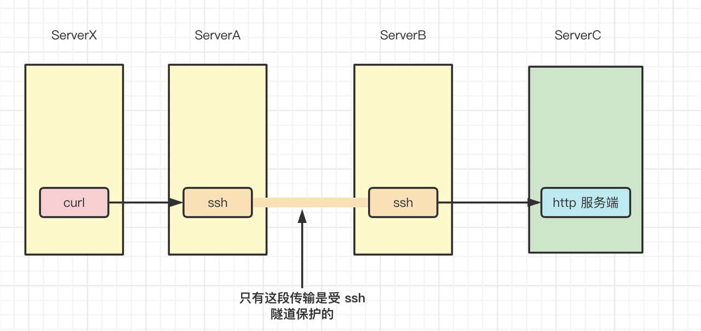

draft: 表示是否草稿 为 true 则编译时不会编译该文章

前面写摘要

<!--more-->

后面写剩下的内容

### 图片路径

图片默认使用本地资源，相对路径

> 相对于当前 md 文件的路径

比如，这样配置


> 具体要跳多少层级，加多少个 ../ 取决于当前 md 文件在什么层级。

最终访问的 URL 为`http://localhost:1313/img/jinx.png`

> 图片是放在 statics 目录的，hugo 编译时会移动到根目录，所以这样可以用，不过缺点是本地看 markdown 的时候加载不了。

大致结构是这样的：

```console
statics
  / img
     jinx.png
posts
  template.md
```


像下面这样配置

文章位置： /posts/linux/ssh-tunnel.md

图片配置：

```bash

```

访问的就是 /statics/img/linux/ssh/ssh-forward-issue.png


### emoji 表情

在这里查看，点击即可复制，然后粘贴到 markdown 即可。

https://hugoloveit.com/zh-cn/emoji-support/